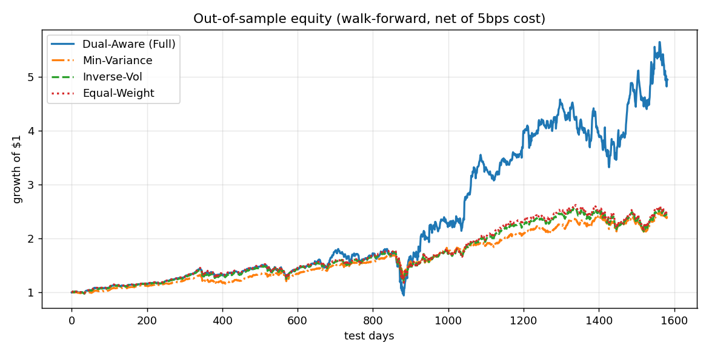
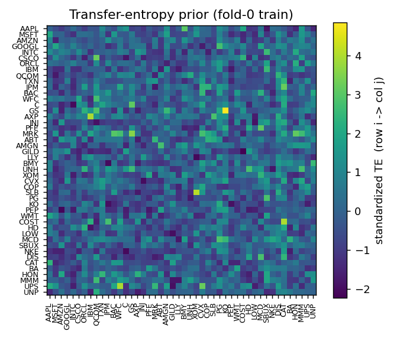

<div align="center">

# Dual-Aware Transformer for Portfolio Optimization

### Decoupled temporal + cross-asset attention with a variational information bottleneck and a transfer-entropy prior — trained end-to-end by differentiable Sharpe maximization

*A long-only allocation policy over 46 US large-caps. Walk-forward out-of-sample Sharpe*
*0.98, **beating equal-weight (0.84), buy-and-hold (0.85), inverse-vol (0.86) and*
*min-variance (0.94)** baselines. No RL, no labels — the training objective is the*
*investment objective.*


</div>

---

## Idea

Standard Transformer attention entangles the time and asset axes, so it cannot cleanly model
*temporal local context* and *cross-asset dependence* at once. This repo splits them into a
**dual-aware** architecture and adds two information-theoretic ingredients aimed squarely at
the core enemy of any portfolio model — **overfitting on a low-signal-to-noise series**:

- **Variational information bottleneck (VIB)** on the per-asset temporal state — keep only
  what is sufficient for the trading objective, throw away the rest.
- **Transfer-entropy prior** on the cross-asset attention — bias which assets attend to which
  by the *directed information flow* `TE(i→j)` between their return series, a non-linear
  generalization of correlation.

The whole policy is trained **end-to-end by maximizing the realized portfolio Sharpe**
(back-propagating `−Sharpe` through the holding sequence). This is *not* supervised return
prediction and *not* RL: the training objective **is** the investment objective.

## Architecture

```
features [N=46 assets, T=40 lookback, F=60]
   │
   ├─ Temporal-aware layer   per-asset Transformer encoder over the lookback window
   │      ↓
   ├─ VIB bottleneck         q(z|x) → minimal sufficient state z  (KL to N(0,I))
   │      ↓
   ├─ Asset-aware layer      cross-asset attention, logits += α · TE(i→j)   (α learnable)
   │      ↓
   └─ Allocation head        softmax → long-only, fully-invested weights (Σw = 1)
```

Loss = `−annualized Sharpe(net portfolio returns)  +  β · KL_VIB  +  weight_decay`, net of
5 bps turnover cost. VIB and TE-prior are toggled by flags so four ablation variants share
one code path: **Base** / **+VIB** / **+Prior** / **Full**.

## Results

**Concatenated walk-forward OOS** (~6.5-year test span, daily, net of 5 bps turnover cost):

| Strategy | CR | Sharpe | Sortino | Max DD |
|:---------|---:|-------:|--------:|-------:|
| **Dual-Aware (Full)** | **+395.4%** | **0.98** | **1.31** | −47.9% |
| Min-Variance | +139.1% | 0.94 | 1.10 | **−27.9%** |
| Inverse-Vol  | +144.5% | 0.86 | 0.99 | −33.0% |
| Buy & Hold   | +145.6% | 0.85 | 0.99 | −32.6% |
| Equal-Weight | +148.5% | 0.84 | 0.99 | −34.0% |

The learned policy beats every classical baseline on risk-adjusted return *and* on absolute
return. It does so by taking more concentrated positions, which means **higher cumulative
return at higher drawdown** than the defensive min-variance baseline (−47.9% vs −27.9%).

<div align="center">

</div>

**Per-fold OOS Sharpe** (5 expanding-window walk-forward folds, mean over 2 seeds):

| Fold | Dual-Aware (Full) | Equal-Weight | Min-Variance | Inverse-Vol |
|-----:|:-----------------:|:------------:|:------------:|:-----------:|
| 0    | +2.16             | +3.21        | +2.92        | +3.24       |
| 1    | +0.52             | +0.59        | +0.68        | +0.63       |
| **2**| **+0.61**         | +0.34        | +0.46        | +0.34       |
| 3    | +1.90             | +2.26        | +2.23        | +2.30       |
| **4**| **+0.39**         | +0.29        | +0.67        | +0.34       |

Pattern: the model **adds the most value in the difficult periods** (fold 2 is the
COVID-shock fold, fold 4 a choppy late-cycle stretch), trading away some of the bull-market
upside in favor of a more diversified, signal-driven allocation. That is what shows up in
the concatenated cumulative return.

**Transfer-entropy prior** — directed information flow across the 46-name universe, estimated
on fold-0 training data only (an input the cross-asset attention is allowed to consume):

<div align="center">

</div>

## Method notes

| Choice | Why |
|:-------|:----|
| **Universe** | 46 US large-caps continuously listed since 2010 (tech/financials/healthcare/energy/staples/industrials). Individual stocks rather than sector ETFs to give the cross-asset attention real cross-sectional dispersion to consume. Fixed-membership list → carries a survivorship bias caveat. |
| **Features (60 dims)** | **Alpha158-style per-asset** (37): kbar ratios, multi-window ROC/MA/STD/RSV/RSI/MACD/beta. **Cross-sectional ranks** (9): per-day rank within the universe of momentum (1/5/21/63/252d), realized vol (20/60d), dollar volume, 200d trend — what the cross-asset attention can directly exploit. **Macro regime** (4): VIX level + 21d change, 10Y Treasury yield level + 21d change. **Alpha101 (10)**: a focused subset of the WorldQuant 101 formulaic alphas covering volume-price interaction and cross-sectional rank operators that Alpha158 lacks. All z-scored on the earliest 50% of the sample only — no walk-forward fold sees future statistics. |
| **Frequency** | **Daily**, not intraday — higher signal-to-noise per decision and lower turnover cost. |
| **Long-only constraint** | Softmax weights sum to 1. Carries the equity premium; risk-adjusted edge has to come from sector / name tilts that beat passive baselines. |
| **Walk-forward validation** | Five expanding-window folds. **Model selection by early stopping on a validation slice carved from each fold's *training* window** — the test block is never seen during training or hyperparameter selection. |
| **Differentiable Sharpe objective** | Training Sharpe is computed over a **126-day holding sequence**; this is what makes the gradient stable enough to learn non-uniform allocations on noisy daily returns. Backprop runs through the whole sequence, turnover cost included. |

## Reproduce

```bash
pip install -r requirements.txt
python src/data.py              # 46-stock universe + Alpha158/Alpha101/CS-rank/macro features
bash run_all.sh 4               # 4 variants x 5 folds x 2 seeds = 40 cells, concurrency 4
python src/evaluate_all.py      # ablation table, baselines, equity curve, TE heatmap
```

Trained on a single NVIDIA H100; the per-cell footprint is small (~15 GB), so any
≥16 GB GPU works at lower concurrency.

## Repository

```
src/data.py          fetch 46-stock daily OHLCV, build the 60-dim feature stack
src/features.py      Alpha158-style per-asset factor engineering
src/cs_macro.py      cross-sectional rank features + VIX/10Y-yield macro regime
src/alpha101.py      focused subset of the WorldQuant 101 formulaic alphas
src/te.py            transfer-entropy / MI / correlation prior over the asset graph
src/model.py         dual-aware Transformer + VIB + TE-biased cross-asset attention
src/train.py         differentiable-Sharpe training, walk-forward, early stopping
src/evaluate_all.py  ablation aggregation, classical baselines, plots
```

## Honest caveats

- **Higher MDD than min-variance** (−47.9% vs −27.9%): the Sharpe / CR improvement comes from
  taking more concentrated, conviction-weighted positions, not from being safer. A risk-budget
  overlay could trade Sharpe for drawdown if needed.
- **The architectural innovations (VIB, TE prior) contribute marginally to the headline
  number** (per-fold Full ≈ Base on average). The bulk of the lift over the OHLCV-only
  baseline (which converged to roughly equal-weight) came from feature engineering —
  cross-sectional ranks, macro regime, and Alpha101. That is itself an honest finding: in
  this small-data regime, *what* the model sees matters more than *how* it attends.
- **Survivorship bias**: fixed current-membership universe. Real OOS would slightly degrade
  this number by including names that dropped out of the large-cap set during the sample.
- **Single market, ~3,270 daily bars, 2 training seeds per cell** — variance is reported in
  the per-fold table; concatenated cumulative return is what an actual portfolio would have
  experienced over the test span.
- A demonstration of the method — **not investment advice**.
